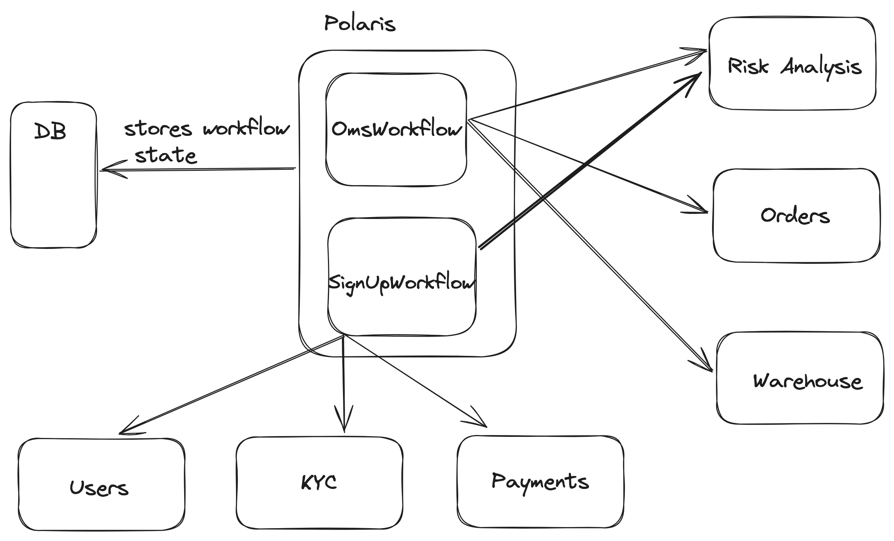
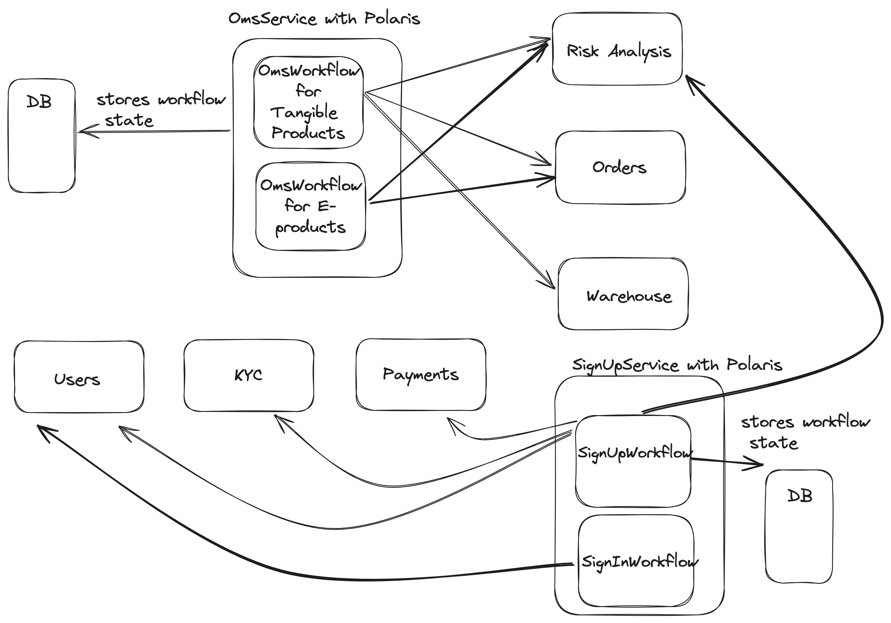

# polaris

The (original) Java counterpart of this workflow orchestrator framework: https://github.com/flipkart-incubator/databuilderframework

## Introduction

The polaris framework is a high level logic execution engine in Golang that can be used to execute multi-step/long running workflows. 

#### When should you use Polaris?

1. You have multi-step workflow executions where each step is dependent on data generated from previous steps.
2. Executions can span one request scope or multiple scopes.
3. Your systems works with reusable components that can be combined in different ways to generate different end-results.
4. Your workflows can pause, resume or even restart from the beginning.
   
## Use cases
1. An OMS for any sort of checkout journey (Zerodha, Uber, Swiggy).
2. Ticket processing flows.
3. Image / Media processing, etc.

## Limitations
1. Workflow versioning is tricky to implement:
   1. Unless you can afford a 100% downtime ensuring all active workflows move into a terminal state, deploying new code requires ensuring backward compatibility.
   2. What this means is - you'll need to a deploy a version of code that is backward compatible for older non terminal workflows while newer ones will execute on the new code.
   3. Once the older workflows have completed, a deployment to clean up stale code will be required.
2. The level of abstraction is lower in this framework compared to Cadence, Conductor:
   1. Workflows can be made fault oblivious if there is an external (reliable) service giving callbacks per workflow id.
   2. Instrumentation can be set up by adding your custom code to push events via listeners.

## Terminologies

* _**Data**_ - The basic container for information generated by an actor in the system. Meta associated:
    * **Data** - Name of the data
* _**Builder**_ - An actor that consumes a bunch of data and produces another data. It has the following meta associated with it:
    * **Name** - Name of the builder
    * **Consumes** - A set of Data that the builder consumes
    * **Produces** - Data that the builder produces
    * **Optionals** - Data that the builder can optionally consume; one possible use case for this: if a builder wants to be re-run on demand with the same set of consumable Data already present, add an optional Data in the Builder and restart the workflow by passing an instance of the optional Data in the DataDelta
    * **Access** - Data that the builder will just access and has no effect on building the topologically sorted ExecutionGraph
* _**Workflow**_ - A specification and container for a topology of connected Builders that generate a final data. It has the following meta:
    * **Name** - Name of the workflow
    * **Target Data** - The name of the data being generated by this data flow
    * **Resolution Specs** - If multiple builders known to the system can produce the same data, then this can be used to put an override specifying which particular builder will generate a particular data in context of this data flow.
    * **Transients** - A set of names of Data that would be considered Transients for this case. (See later for a detailed explanation of transients)
* _**ExecutionGraph**_ - A graph of connected and topologically sorted builders that are used by the execution engine to execute a flow. 
* _**DataSet**_ - A set of the Data provided by the client and generated internally by the different builders of a particular ExecutionGraph
* _**DataFlowInstance**_ - An instantiation of DataFlow that contains it's own copy of ExecutionGraph and DataSet. This represents the execution context of a particular request.
* _**DataDelta**_ - The set of new data that needs to be considered as input for a particular execution
* _**DataFlowExecutor**_ - The core engine that uses the provided DataDelta to execute the ExecutionGraph present in the given DataFlowInstance. This will augment the DataSet within the DataFlowInstance with the non-transient Data generated by the different Builders. All newly generated Data by the engine (including generated transient Data) is returned.
* _**DataSetAccessor**_ - A typesafe utility for accesing Data present in a DataSet. This is used inside the Builders to generate Data.

## How does the framework perform at scale?
The framework itself has extremely low overhead. Since execution graphs are generated pre-runtime, all the orchestrator will do at runtime is use the graph and available data to run whichever builders can be run. Benchmarking pending.

## Usage specs
There are two ways to integrate Polaris to run your workflows.

### Distributed workflows with a generic orchestrator service

Assume you have two workflows in your org, and your microservice architecture has clear separation of concerns.
You have the following microservices:
1. Users service - manages info for users
2. KYC - talks with multiple external entities to complete KYC for users
3. Payments - talks with Payment Gateways to initiate and process transactions
4. Orders - manages order creation and updation
5. Warehouse - manages warehouse ops
6. Risk Analysis - Performs risk checks for orders and users

Based on these, you have two workflows - an OmsWorkflow and a SignInWorkflow / SignUpWorkflow
You would spin up another service solely running Polaris. This service would now become the central repository for storing all workflows with their states and would "drive" them end to end via RPCs.
   
Benefits:
1. You can track all your workflows in a single service
2. Building fault tolerance to rerun failed workflows is managed in a single service

### Workflows in multiple "driver" services if you have tens of microservices

Assume you have multiple workflows by category and your architecture has separation of concerns for workflows by category
SignUp/SignIn service to manage
1. SignUpWorkflow
2. SignInWorkflow

OmsService to manage
1. OmsWorkflow for tangible products
2. OmsWorkflow for downloadable products (e-books, music)

In that case, you would integrate Polaris across both services and built fault tolerance for both of them.
Benefits:
1. Separation of concerns per category
2. Avoids single point of failure for workflows across the org
3. Easy to manage if you are a big org with multiple devs
