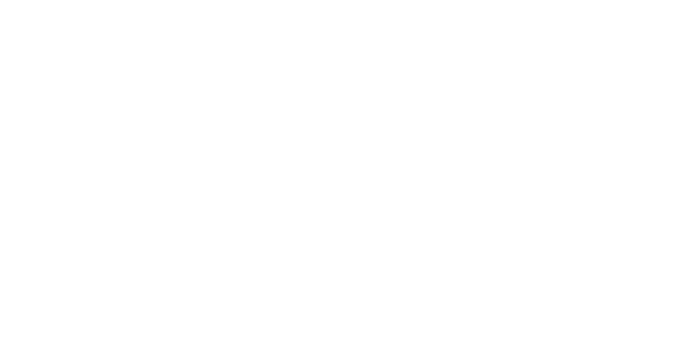

<div align="center">
  <a href="https://harshadmanglani.github.io/polaris">
    
  </a>

  <p>
     An extremely light weight workflow orchestrator for Golang.
  </p>
  
  <p>
    <a href="https://harshadmanglani.github.io/polaris/get-started/">Installation</a> | <a href="https://harshadmanglani.github.io/polaris/usage/">Documentation</a> | <a href="https://x.com/polaris_golang">Twitter</a> | <a href="https://github.com/flipkart-incubator/databuilderframework">Inspiration</a>
  </p>
</div>

# Quick overview
Polaris helps you create, store and run workflows.
A workflow is a series of multiple steps, and can often be long running.

You don't need to worry about:
- Sequence of steps (it will figure out which the sequence along with the ones that can run concurrently)
- Explicitly pausing workflows (when it runs out of new data to move the workflow ahead, it pauses)

# Payments and Fulfilment

Polaris is especially useful for payments, e-commerce and fulfilment use cases. Consider a payment gateway trying to process payments via cards and netbanking.

Often, a lot of the logic would overlap - such as invoicing, settlements, etc. Polaris can neatly structure your code, making it more maintainable than ever.

```go
type CardPaymentWorkflow struct{}

func (w CardPaymentWorkflow) GetWorkflowMeta() WorkflowMeta {
    return WorkflowMeta{
        Builders: []IBuilder{
            InitiateReq{},
            EncryptCardInfo{},
            TokenizeCard{},
            ProcessPayment{},
            OTPVerification{},
            PaymentComplete{},
            GenerateInvoice{},
        },
        TargetData: PaymentCompletedData{},
    }
}
```

```go
type NetbankingPaymentWorkflow struct{}

func (w NetbankingPaymentWorkflow) GetWorkflowMeta() WorkflowMeta {
    return WorkflowMeta{
        Builders: []IBuilder{
            InitiateReq{},
            FetchBankRedirectURL{},
            RedirectAndCollect{},
            ProcessBankPayment{},
            OTPVerification{},
            PaymentComplete{},
            GenerateInvoice{},
        },
        TargetData: PaymentCompletedData{},
    }
}
```

For more details, dive into the <a href="https://harshadmanglani.github.io/polaris/usage/">docs</a>!